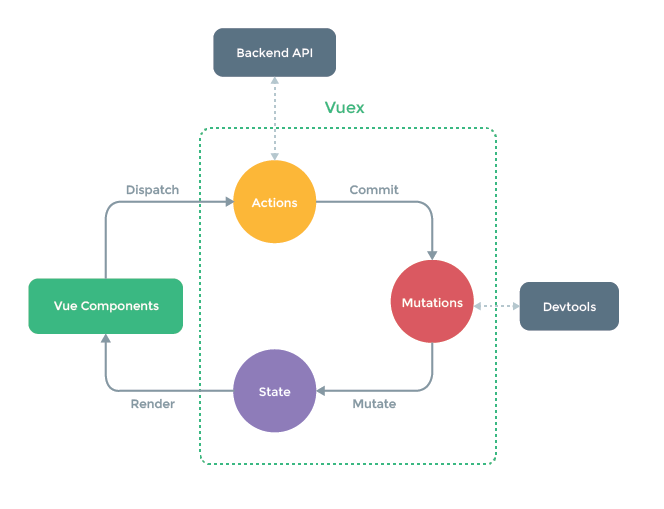

# news-blog-client
### Vue.js를 이용한 뉴스 블로그 페이지 구현

---

## Requirements
- News
  - Open API ([Hacker News Open API](https://github.com/tastejs/hacker-news-pwas/blob/master/docs/api.md))를 통한 news data 가져오기
- User Info
  - 사용자 정보 data 가져오기
- Post data
  - 특정 Post에 대해 query 값을 이용하여 내용 data 가져오기
- Router를 통한 페이지 전환
  - [Hacker News Page](https://news.ycombinator.com/)의 show, ask, jobs에 해당하는 페이지 구현
  - 구조: 5개의 page
    - News, Ask, Jobs, 질문하기, 사용자 정보보기 페이지

---

## 관련 개념
- Dir 구조
  - main.js
    - 기본적으로 application의 설정(plugin, lib), 구조도의 blueprint를 볼 수 있어야 함 
  - api/index.js
    1. HTTP Request & Response와 관련된 기본 설정
        - `baseUrl`
    2. API 함수들을 정리
        - ```axios.get(`${config.baseUrl}posts`)```
  - components/
    - **Presentational Component**
      - 화면을 그리는 Components
    - 이벤트가 일어나면 상위에 알리고 결과 데이터를 받아 화면을 갱신한다.
  - views/
    - **Container Component**
      - 데이터를 가지고 조작하는 Components
    - vuex의 actions를 호출해서 데이터를 조작한다.
    - `this.$store.dispath("store actions의 함수 이름");`
  - store/index.js (Vuex이용 - 아래 참고)
    - actions
      1. BackEnd에서 API(api/index.js에 정의)를 호출한다. 
          - 즉, 비동기 호출은 모두 actions에서 처리한다.
      2. API 응답 결과 데이터를 Mutations에 보낸다.
          - `context.commit("mutations 함수 이름", response.data)`
    - mutations
      - 받아온 데이터로 state의 속성을 변경한다.
    - state
      - 여러 Component가 공유하는 데이터를 관리한다.
    - 추가로 모듈화할 수 있다. (mutations.js, actions.js)
- Vue CLI 2.x VS [Vue CLI 3.x](https://cli.vuejs.org/)
  - webpack 설정 파일이 노출되지 않음
    - **2.x**: `webpack.config.js` 존재
    - **3.x**: webpack을 위해 별도의 [설정](https://cli.vuejs.org/guide/webpack.html#working-with-webpack)이 필요
  - 프로젝트 구성
    - **2.x**: gitHub의 템플릿 다운로드, package.json의 설치된 내용을 npm install로 추가해야 함
    - **3.x**: 플러그인 기반으로 기능 추가, node_modules 자동으로 추가됨
  - ES6
    - **2.x**에서는 ES6에 대한 이해도가 낮지만, **3.x**에서는 기본 세팅이 ES6로 되어 있음
  - 생성 명령어
   ```bash
   // 2.x
   $ vue init webpack-simple [vue-news] // 생성: vue init '프로젝트 템플릿 이름' '파일 위치'
   $ npm run dev // 실행
   ```
   ```
   $ npm install -g @vue/cli
   $ npm uninstall -g vue-cli
   
   // 3.x
   $ vue create [vue-news] // 생성: vue create '프로젝트 이름'
   $ npm run serve // 실행

   ```
- [Vue Router](https://router.vuejs.org/kr/)
  - 설치 
    ```bash
    $ npm install vue-router --save
    ```
  - 기본 설정
    - src/router directory 생성 후 하위에 index.js 생성
   ```js
   /* src/router/index.js */
   import Vue from 'vue';
   import VueRouter from 'vue-router';
   import MainView from "../views/MainView.vue" // custom path
   
   Vue.use(VueRouter);
   export const router = new VueRouter({ // router instance 생성
     routes: [
       {
         path: '/', // url 주소
         component: MainView, // url 주소로 갔을 때 표시될 Component (Page로 사용되는 Component)
       },
       // ... (같은 구조로 route 정보 추가)
     ]
   });
   ```
   ```js
   /* src/main.js */
   import { router } from "./router/index.js"; // 반드시 { router }로 받는다. (이름 변경 X)

   new Vue({
     render: h => h(App),
     router, // 추가
   }).$mount('#app')
   ```
- **axios**를 이용한 API 호출
  - axios는 Promise 기반으로 API를 제공한다.
    - `new Promise`를 반환
    - .then().catch() 사용
  - axios 설치
   ```bash
   $ npm install axios --save
   ```
  - data 요청은 `created`, `beforeMount` lifecycle에서 많이 함
    - mounted 후에 요청을 하게 되면 데이터 안에 값을 넣으면 화면이 다시 그려지기 때문에 
    - [Vue가 화면을 그리는 구조](https://vuejs.org/v2/guide/reactivity.html#ad) 참고
- [Vuex](https://vuex.vuejs.org/kr/guide/)
  - **Vuex**(상태 관리 도구)를 이용한 데이터 호출 방법
    - Component에서 직접 API를 호출해서 data를 처리하던 것을 중간에 Vuex를 통해서 data를 전달하고 관리할 수 있다.
    - Vuex의 State에 API를 담아서 화면에 표시
    - -> 
      - **상태(state):** 여러 Component 간의 공유되는 data 속성
      - **actions**: Server에서 API(api/index.js)를 호출하고 결과 data를 mutation으로 commit한다.
      - **mutations**: 인자로 받은 결과 data로 state 속성값을 변경한다.
      - **getters**: 상태값을 반환한다. (Component의 computed와 동일한 속성)
  - 설치 
    ```bash
    $ npm install vuex
    ```
  - 기본 구조 과정 예시
  - -> 
    1. Container Component에서 Vuex의 actions를 dispatch한다.
    2. Vuex actions에서 Server의 API(api/index.js)를 호출하고 결과 data를 mutation으로 commit한다.
    3. Vuex mutations에서 인자로 받은 결과 data로 state 속성값을 변경한다.
    4. 변경된 state 값을 이용해 Presentation Component의 화면을 갱신한다.
        - computed에서 mapGetters 배열 표기법으로 Vuex getters의 값을 받아올 수 있다.
        - Ex. AskView.vue의 computed
  - 사용방법에 따른 데이터 흐름
    - 

### JavaScript
- this 바인딩 (4가지)
1. 브라우저 Window 객체를 가리키는 this
    - return: `Window {...}`
2. 함수 안의 this -> Window 객체 
    ```js
    function sum(a, b) { 
      console.log(this); // return: Window {...}
      return a + b;
    }
    ```
3. 인스턴스를 정의한 객체 자체를 가리키는 this (생성자 함수를 가리킴)
    ```js
    function Vue(el) {
      console.log(this); // return: Vue {}
      this.el = el;
    }
    new Vue('#app');
    ```
4. 비동기 처리에서의 this
    ```js
    created() {
      console.log('호출 전: ', this); // return: VueComponent { ... }
      axios.get('')
      .then(function(response) {
        console.log('호출 후: ', this); // return: undefined
        this.users = response.data;
      })
      .catch(function(error) {
      });
    }
   ```
    - 데이터를 Server로부터 가져오기 위해서는 http 프로토콜을 통해 Server에 갔다오기 때문에 비동기 호출을 해야 함
    - 현재 위치(비동기 호출되는 시점)에서 가리키는 this와 그것을 벗어난 this가 생긴다.
      - 기존의 것을 가리키고 싶으면 this 바인딩을 새로 해야한다.
      - 즉, `var vm = this;`, `vm.users = response.data`로 사용해야 한다.
      - 하지만 ES6 화살표 함수를 사용하면 this는 비동기 호출되는 시점의 this를 가지고 온다. (아래 참고)
    - **[참고]** 화살표 함수의 this
      ```js
      created() {
        console.log('호출 전: ', this); // return: VueComponent { ... }
        axios.get('URL_ADDRESS')
        .then(response => {
          console.log('호출 후: ', this); // return: VueComponent { ... }
          this.users = response.data;
        })
        .catch();
      }
      ```
- 비동기 처리
1. Callback
    - **Callback:** 특정 함수/기능이 종료되자마자 실행되는 함수
    - **Callback 함수:** 함수를 인자로 전달하는 함수 
    - Callback 예시
      ```js
      function fetchData() {
        var result = [];

        $ajax({
          url: 'URL_ADDRESS',
          success: function(data) {
            console.log('data 호출 결과', data); // 2.
            result = data;
            // 해당 위치에서 함수 결과 출력 
          }
        });

        console.log('함수 결과', result); // 1.
      }
      ```
      - 데이터 요청에 대한 응답을 기다리기 전에 다음 코드를 수행한다. 
      - 즉, ajax보다 함수 결과 log가 먼저 호출되기 때문에 result에 데이터를 받아오지 못한다. 
      - result를 출력하고 싶으면 success 후에 출력해야 한다.
        - "Promise" 기법 (아래 참고)
      - **Callback Hell, Nested**
        - Callback을 계속 쌓다보면 여러 문제가 생긴다.
          - 코드 indent 문제 
          - 절차적인 사고에 위배
        - 이런 문제를 해결하기 위해 "Promise" (아래 참고) 사용
2. Promise
    - **Promise:** 효율적인 Callback 관리 및 직관적인 코드 구현을 위해 사용하는 비동기 처리 패턴
      - [Promise MDN](https://developer.mozilla.org/ko/docs/Web/JavaScript/Reference/Global_Objects/Promise) 참고 
    - Promise Chaining도 가능
      - [프로미스 쉽게 이해하기](https://joshua1988.github.io/web-development/javascript/promise-for-beginners/) 참고
    - cf. ajax의 success 속성
      - ajax 요청이 성공해야 실행되도록하는 속성 
      - ajax lib에서 제공하므로 'ajax에서만' 유효한 Callback 함수
    - Promise 구성
      ```js
      new Promise
        .then(성공 후 수행할 내용)
        .catch(실패 후 수행할 내용);
      ```
    - Promise 예시
      ```js
      function callAjax() { // Promise 객체 반환
        return new Promise(function(resolve, reject) {
          $.ajax({
            url: 'URL_ADDRESS',
            success: function(data) {
              resolve(data); // resolve된 상태의 Promise가 .then으로 넘어간다.
            }
          });
        });
      }

      function fetchData() {
        var result = [];

        callAjax()
          .then(function(data) { // resolve된 data가 함수로 들어온다.
            console.log('데이터 호출 결과', data);
            result = data;
            console.log('함수 결과', result);
          });
      }
      ```

---

## Development Environment
- [Vue.js](https://vuejs.org/)
- [vue cli 3.x](https://cli.vuejs.org/)
- [vuex](https://vuex.vuejs.org/kr/)
- [vue router](https://router.vuejs.org/kr/)

## References
* [장기효(캡틴 판교) - Vue.js 완벽 가이드](https://www.inflearn.com/course/vue-js/)
* [Hacker News Open API](https://github.com/tastejs/hacker-news-pwas/blob/master/docs/api.md)
* [Hacker New Page](https://news.ycombinator.com/)
